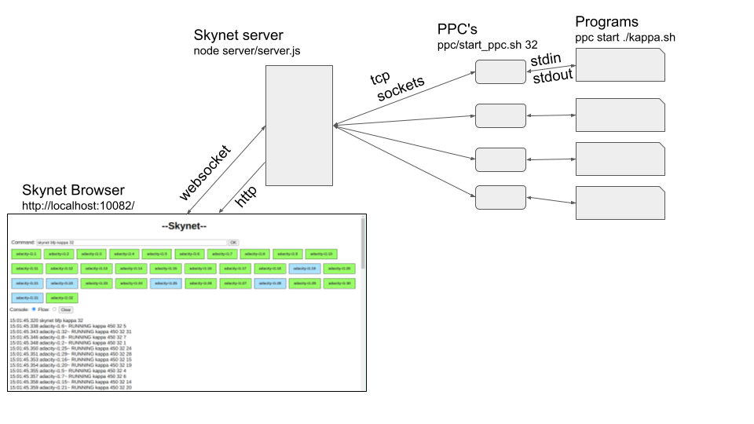

# Skynet

Master control framework for parallel AI

This uses node.js to create a webserver and a websocket server, serving a webpage (browser/index.html) as
a console from which the status of the Path Processors can be seen and commands and data exchenged with those.



## Install

```
sudo apt install nodejs

git clone https://github.com/ijl20/prologpf

cd prologpf/skynet-node

export PATH=./node_modules/.bin:$PATH
```

## Run the server

This will run:
* a http server (to serve content from the `browser`directory.
* a websockets server (on same port as http server).
* a TCP socket server (that the PPC's connect over).

The port numbers and http docroot are defined in `server/server.js`.

```
cd prologpf/skynet-node
node server.js
```

Then browse to `localhost:<portnumber>`as defined in `server.js`

## Run a PPC

If necessary compile ppc.c with:
```
cd prologpf/skynet-node/ppc
gcc -o ppc ppc.c
```

Note we launch the PPC's so their current directory is `prologpf/skynet-node/ppc` as that directory also
provides a convenient location for the programs for the PPC to run.

Then to run a PPC:
```
cd prologpf/skynet-node/ppc
./ppc adacity one
```
where adacity is a chosen 'host' name, and 'one' is a chosen PPC 'slot'. We are assuming multiple PPC's will
be run on each physical machine.

## Run multiple PPC's on a single host

E.g. to run TWELVE PPC's on the current server:
```
cd prologpf/skynet-node/ppc
./start_ppc.sh 12
```

The PPC's 1..12 will log to `/tmp/ppc_$i.log`and `/tmp/ppc_$i.err`. So that logging can be monitored with e.g.:
```
tail -F /tmp/ppc_1.log
```

## Run a program on ALL connected PPC's

In this example we will run the 'hostname' linux command on all connected PPC's.

In the browser 'Command:' input box, enter:
```
ppc start hostname
```
The browser will log the stdout from the executing programs in the browser window.

## Run a PrologPF program on all connected PPC's

1. Run the server (see above)
2. Run TWELVE PPC's (see above)

The connected PPC's should be visible in the Skynet browser window with status YELLOW (ppc_idle).

3. Run `kappa.sh` on all the PPC's with the Skynet command: `ppc start ./kappa.sh`.

All the PPC's should change status to BLUE (ppc_waiting).

4. Initiate the prologpf program execution with command `skynet bfp kappa 12`

The PPC's status will change to GREEN (ppc_running) and the execution process will continue with splitting etc.
