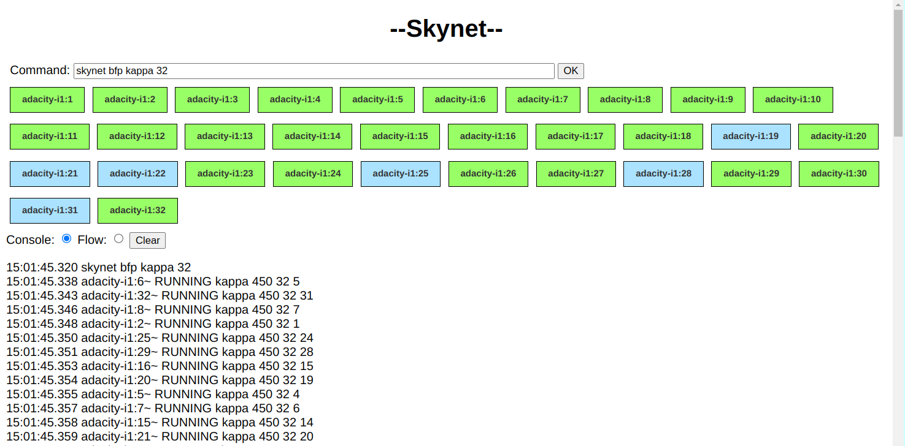

# Skynet Console

This is the http webpage served by node.js that provides the 'console'
interface to Skynet.

After the page is served by (nodejs) server.js, this page connects via websocket back to server.js and receives
custom JSON messages from the server, many of which are relayed from the PPC's.
